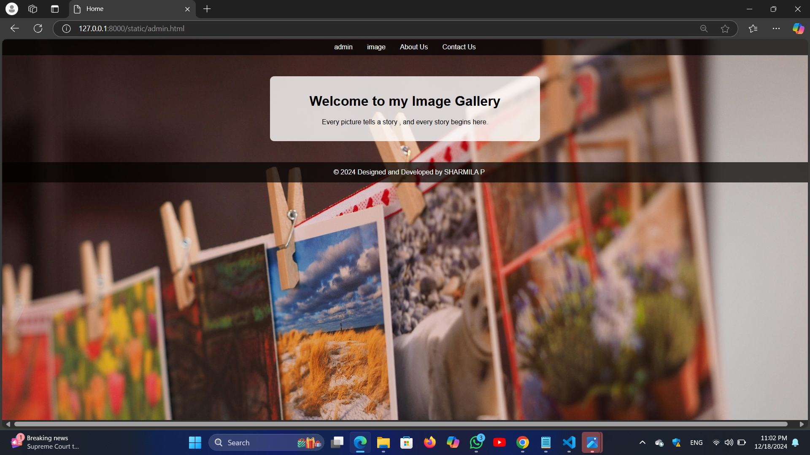
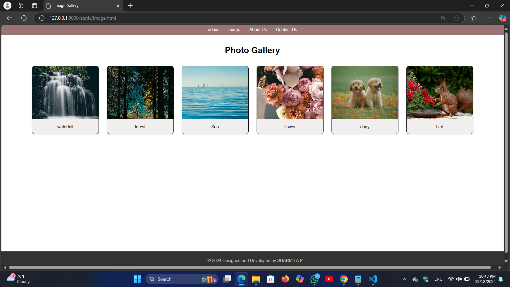
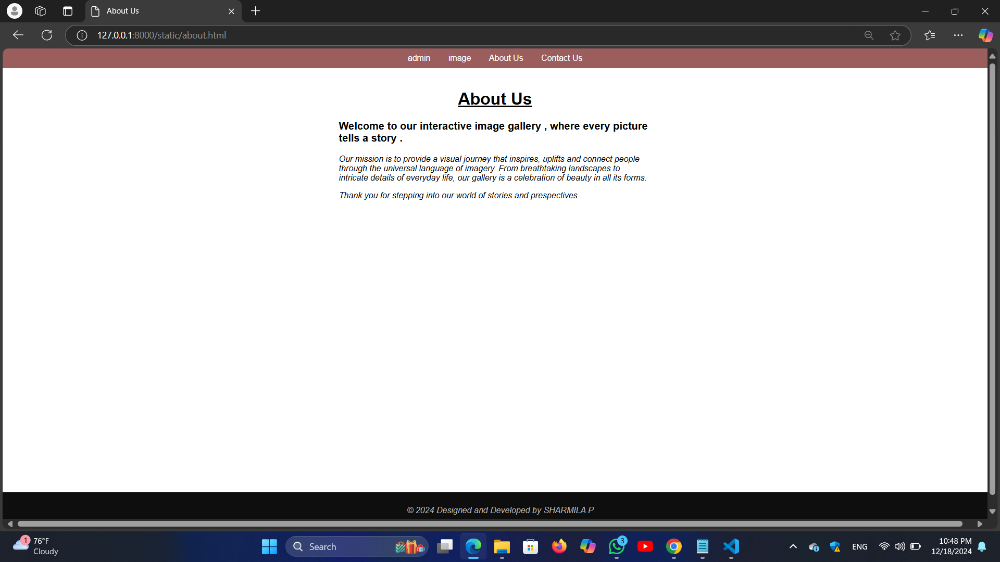
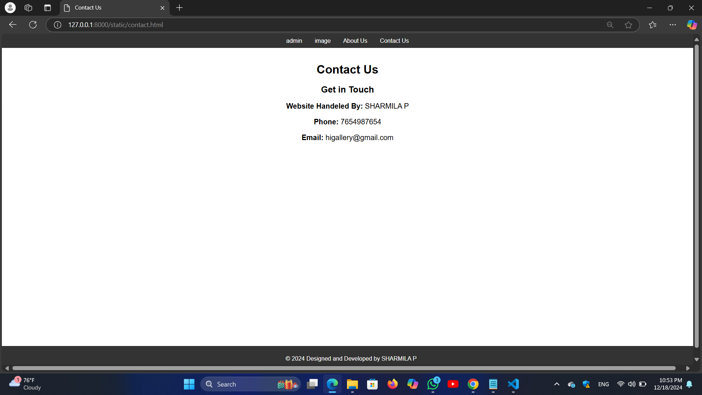

# Ex.08 Design of Interactive Image Gallery
## Date:18.12.2024

## AIM:
To design a web application for an inteactive image gallery with minimum five images.

## DESIGN STEPS:

### Step 1:
Clone the github repository and create Django admin interface.

### Step 2:
Change settings.py file to allow request from all hosts.

### Step 3:
Use CSS for positioning and styling.

### Step 4:
Write JavaScript program for implementing interactivity.

### Step 5:
Validate the HTML and CSS code.

### Step 6:
Publish the website in the given URL.

## PROGRAM :
```
admin.html
<!DOCTYPE html>
<html lang="en">
<head>
    <meta charset="UTF-8">
    <meta name="viewport" content="width=device-width, initial-scale=1.0">
    <title>Home</title>
    <style>
        body { 
            font-family: Arial, sans-serif; 
            margin: 0; 
            background-image: url('bg1.jpg'); 
            background-size: cover; 
            background-repeat: no-repeat; 
            background-attachment: fixed; 
        }
        header { 
            background: rgba(0, 0, 0, 0.7); 
            color: rgb(133, 131, 131); 
            padding: 10px; 
            text-align: center; 
        }
        nav a { 
            color: white; 
            margin: 0 15px; 
            text-decoration: none; 
        }
        nav a:hover { 
            text-decoration: underline; 
        }
        main { 
            text-align: center; 
            padding: 20px; 
            background: rgba(255, 255, 255, 0.8); 
            margin: 50px auto;
            max-width: 600px;
            border-radius: 10px;
        }
        footer { 
            background: rgba(0, 0, 0, 0.7); 
            color: white; 
            text-align: center; 
            padding: 10px; 
            position: relative; 
            bottom: 0; 
            width: 100%; 
        }
        footer p { 
            margin: 5px 0; 
        }
        footer a { 
            color: lightblue; 
            text-decoration: none; 
        }
        footer a:hover { 
            text-decoration: underline; 
        }
    </style>
</head>
<body>
    <header>
        <nav>
            <a href="admin.html">admin</a>
            <a href="image.html">image</a>
            <a href="about.html">About Us</a>
            <a href="contact.html">Contact Us</a>
        </nav>
    </header>
    <main>
        <h1>Welcome to my Image Gallery</h1>
        <p>Every picture tells a story , and every story begins here.</p>
    </main>
    <footer>
        <p>&copy; 2024 Designed and Developed by SHARMILA P</p>
            </footer>
</body>
</html>

image.html

<!DOCTYPE html>
<html lang="en">
<head>
    <meta charset="UTF-8">
    <meta name="viewport" content="width=device-width, initial-scale=1.0">
    <title>Image Gallery</title>
    <style>
        body {
            font-family: Arial, sans-serif;
            margin: 0;
            padding: 0;
            display: flex;
            flex-direction: column;
            min-height: 100vh;
        }
        header {
            background: #9c7373;
            color: rgb(179, 106, 106);
            padding: 10px;
            text-align: center;
        }
        nav a {
            color: white;
            margin: 0 15px;
            text-decoration: none;
        }
        nav a:hover {
            text-decoration: underline;
        }
        main {
            flex: 1; /* Ensures main content stretches to push footer to the bottom */
            padding: 20px;
        }
        .gallery {
            display: flex;
            flex-wrap: wrap;
            justify-content: center;
            gap: 30px;
            padding: 20px;
        }
        .photo {
            background: rgb(240, 238, 238);
            border: 1px solid #080808;
            border-radius: 10px;
            box-shadow: 0 2px 4px rgba(0, 0, 0, 0.1);
            overflow: hidden;
            width: 250px;
            text-align: center;
        }
        .photo img {
            width: 100%;
            height: 200px;
            object-fit: cover;
        }
        .photo-title {
            font-size: 18px;
            font-weight: bold;
            margin: 10px 0;
        }
        .photo-description {
            font-size: 14px;
            color: #f7f6f6;
            margin: 0 10px 10px;
        }
        footer {
            background: #333;
            color: rgb(191, 187, 187);
            text-align: center;
            padding: 10px;
            width: 100%;
        }
        footer a {
            color: rgb(11, 11, 11);
            text-decoration: none;
            margin: 0 5px;
        }
        footer a:hover {
            text-decoration: underline;
        }
    </style>
</head>
<body>
    <header>
        <nav>
            <a href="admin.html">admin</a>
            <a href="image.html">image</a>
            <a href="about.html">About Us</a>
            <a href="contact.html">Contact Us</a>
        </nav>
    </header>
    <main>
        <h1 style="text-align: center; margin: 20px 0;">Photo Gallery</h1>
        <div class="gallery">
                <div class="photo">
                
                <p>waterfall</p>
                </div>
                <div class="photo">
                
                <p>forest</p>
                </div>
                <div class="photo">
                
                <p>Sea</p>
                </div>
                <div class="photo">
                
                <p>flower</p>
                </div>
                <div class="photo">
                
                <p>dogy</p>
                </div>
                <div class="photo">
                
                <p>bird</p>
                </div>

                        </div>
    </main>
    <footer>
       <p> &copy; 2024 Designed and Developed by SHARMILA P</p>
    </footer>
</body>
</html>

about.html

<!DOCTYPE html>
<html lang="en">
<head>
    <meta charset="UTF-8">
    <meta name="viewport" content="width=device-width, initial-scale=1.0">
    <title>About Us</title>
    <style>
        body {
            font-family: Arial, sans-serif;
            margin: 0;
            padding: 0;
            display: flex;
            flex-direction: column;
            min-height: 100vh;
        }
        header {
            background: #9c5d5d;
            color: white;
            padding: 10px;
            text-align: center;
        }
        nav a {
            color: white;
            margin: 0 15px;
            text-decoration: none;
        }
        nav a:hover {
            text-decoration: underline;
        }
        main {
            flex: 1; /* Ensures main content stretches to push footer to the bottom */
            padding: 20px;
            text-align: center;
        }
        main .content {
            max-width: 600px;
            margin: 0 auto;
            text-align: left;
        }
        footer {
            background: #0e0e0e;
            color: rgb(184, 180, 180);
            text-align: center;
            padding: 10px;
            width: 100%;
        }
        footer a {
            color: lightblue;
            text-decoration: none;
            margin: 0 5px;
        }
        footer a:hover {
            text-decoration: underline;
        }
    </style>
</head>
<body>
    <header>
        <nav>
            <a href="admin.html">admin</a>
            <a href="image.html">image</a>
            <a href="about.html">About Us</a>
            <a href="contact.html">Contact Us</a>
        </nav>
    </header>
    <main>
        <h1><u>About Us</u></h1>
        <div class="content">
            <p><p style="font-size: 20px;"><b>Welcome to our interactive image gallery , where every picture tells a story .</b></p></p> 
            <p><p style="font-size:16px;"><i>Our mission is to provide a visual journey that inspires, uplifts and connect people through the universal language of imagery. From breathtaking landscapes to intricate details of everyday life, our gallery is a celebration of beauty in all its forms. </p>
            <p><i>Thank you for stepping into our world of stories and prespectives.</i></p></p>
        </div>
    </main>
    <footer>
        <p>&copy; 2024 Designed and Developed by SHARMILA P</p>
    </footer>
</body>
</html>

contact.html

<!DOCTYPE html>
<html lang="en">
<head>
    <meta charset="UTF-8">
    <meta name="viewport" content="width=device-width, initial-scale=1.0">
    <title>Contact Us</title>
    <style>
        body {
            font-family: Arial, sans-serif;
            margin: 0;
            padding: 0;
            display: flex;
            flex-direction: column;
            min-height: 100vh;
        }
        header {
            background: #333;
            color: white;
            padding: 10px;
            text-align: center;
        }
        nav a {
            color: white;
            margin: 0 15px;
            text-decoration: none;
        }
        nav a:hover {
            text-decoration: underline;
        }
        main {
            flex: 1; 
            padding: 20px;
            text-align: center;
        }
        main form {
            max-width: 500px;
            margin: 0 auto;
            text-align: left;
        }
        form label {
            display: block;
            margin-top: 10px;
            font-weight: bold;
        }
        form input, form textarea {
            width: 100%;
            padding: 10px;
            margin-top: 5px;
            border: 1px solid #ddd;
            border-radius: 5px;
            font-size: 14px;
        }
        form button {
            margin-top: 15px;
            padding: 10px 20px;
            background: #333;
            color: white;
            border: none;
            border-radius: 5px;
            cursor: pointer;
        }
        form button:hover {
            background: #555;
        }
        footer {
            background: #333;
            color: white;
            text-align: center;
            padding: 10px;
            width: 100%;
        }
        footer a {
            color: lightblue;
            text-decoration: none;
            margin: 0 5px;
        }
        footer a:hover {
            text-decoration: underline;
        }
    </style>
</head>
<body>
    <header>
        <nav>
            <a href="admin.html">admin</a>
            <a href="image.html">image</a>
            <a href="about.html">About Us</a>
            <a href="contact.html">Contact Us</a>
        </nav>
    </header>
    <main>
        <h1>Contact Us</h1>
        <section class="contact">
        <h2>Get in Touch</h2>
        <p><strong><p style="font-size: 20px;">Website Handeled By:</strong> SHARMILA P</p></p>
        <p><strong><p style="font-size: 20px;">Phone:</strong> 7654987654</p></p>
        <p><strong><p style="font-size: 20px;">Email:</strong> higallery@gmail.com</p></p>
    </section>

            </main>
    <footer>
        <p>&copy; 2024  Designed and Developed by  SHARMILA P</p>  
 </footer>
</body>
</html>
```
## OUTPUT:







## RESULT:
The program for designing an interactive image gallery using HTML, CSS and JavaScript is executed successfully.
